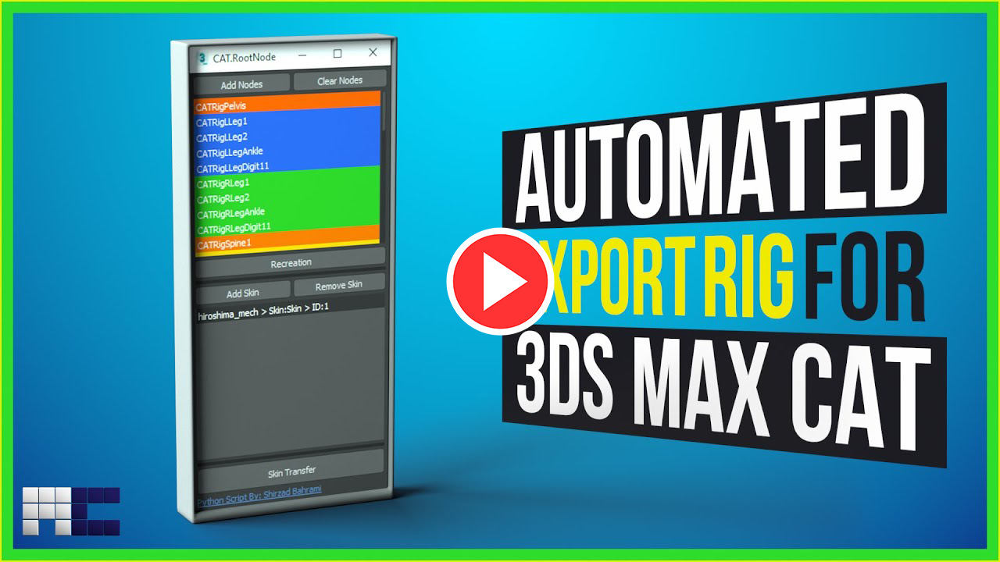

# Fork notes

Just there so I could do a pull request to add support for 3ds Max 2023 & 2025

# CAT.RootNode
## Transfer the CAT rig and skins to a new rig structure with a root bone

---
## Video Tutorial:

---
## How To Use:

### 1. Run CAT.RootNode:
* Run **CAT.RootNode** by pressing the **X** button and search **CAT.RootNode**
* Also, you can assign a shortcut to it using **Hotkey Editor**
  
### 2. Selecting the CAT bones:
  * Select All the CAT bones, try not to add the wrong type of nodes like **IK, Handles, ...etc**
  * Also script filters the nodes and just let the **"CAT one / Hub Object"** class go through
---

### 3. Adding the CAT nodes:
  * Press the **Add Nodes** button to add CAT bones to the node list
  * You can remove the bones by pressing the **Clear Nodes**
### 4. Recreating the rig structure:
  * By pressing the **Recreation** button, create new bones with a root bone
  * New nodes have the same **Name, Color and Position**
  * Also the position and rotation of the new nodes are **constrained** to the CAT bones
---

### 5. Select the Model with Skin Modifier:
  * Now Select the mesh and in the **modify** panel select the skin modifier and press the **Add Skin**
### 6. Adding more Models:
  * If your character has more than one object with skins repeat the process and add all of them to the list
  * If you have selected the wrong model you are able to select it in the list and remove selected from the **Skin List**
  * By selecting the object in the **Skin List** 3Ds Max will select them
---

### 7. Transfer the skin data:
  * Press the **Skin Transfer** button to transfer the skin data from the old modifier to a new one named **"Transferred Skin"**
  * Note that your old Skin modifier is still there but it's disabled
### 8. Enjoy!
  * Now each of your models has a new **"Transferred Skin"** and they are attached to the new nodes instead of CAT bones.
  
---
>Easy installation: 
	Run "One-Click Installation.bat".
	
>installation: 
	Unzip the "CATRootNode.zip" inside "C://ProgramData//Autodesk//ApplicationPlugins".
	
>How To Run: 
	Now, it's a MacroScript, which you can assign a shortcut to it or search it using "X" in 3Ds Max.
	
>Supported Version:

    2020 - 2021 - 2022
