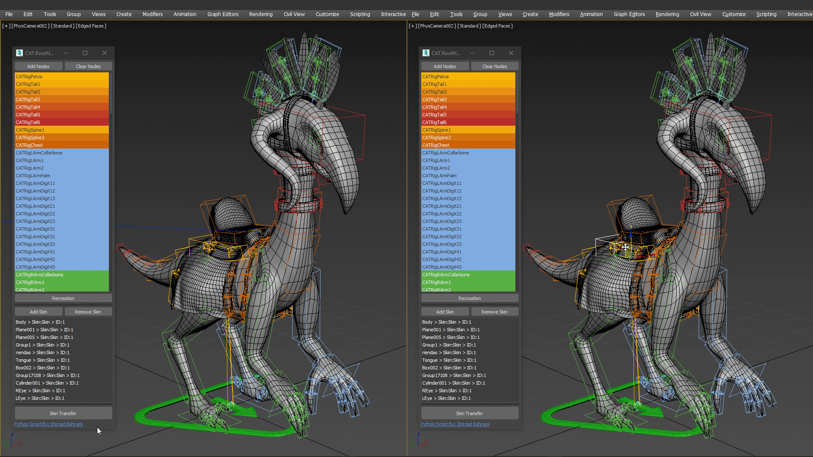

# CAT.RootNode
Transfer the CAT rig to a new rig structure with a root bone and transfered skins.

---
## How To Use:

### 1. Run CAT.RootNode:
  * Run **CAT.RootNode** by pressing the **X** button and search **CAT.RootNode**
  * Also you can assign a shortcut to it using **Hotkey Editor**
  
### 2. Selecting the CAT nodes:
  * Select All the CAT bones, try not to add wrong type of nodes like **IK, Handles, ...etc**
  
---

### 3. Adding the CAT nodes:
  * Press the **Add Nodes** button to add CAT bones to the node list
  * You can remove the bones by presing the **Clear Nodes**
  * Also script filters the nodes and just let the **"CAT one / Hub Object"** class go through
### 4. Recreating the rig structure:
  * By pressing the **Recreation** button, create new bones with a root bone
  * New nodes have the same name/color/position
  * Also the position and rotation of the new nodes are constrained to the CAT nodes
