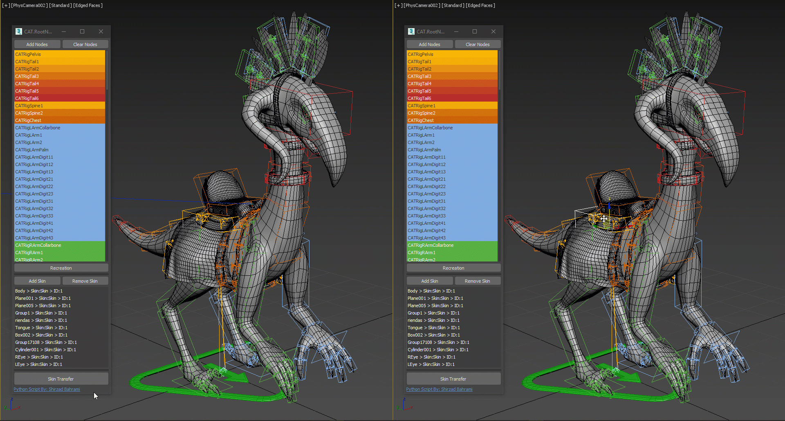
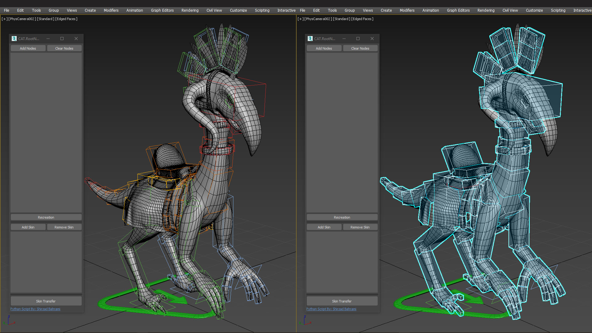
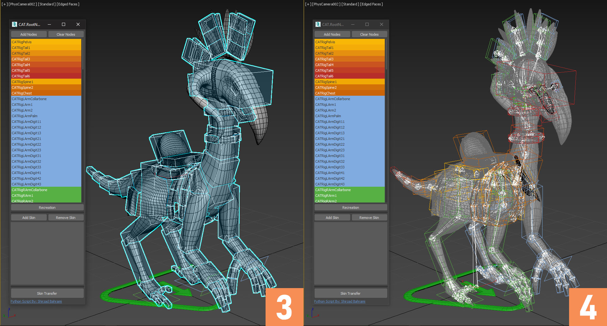
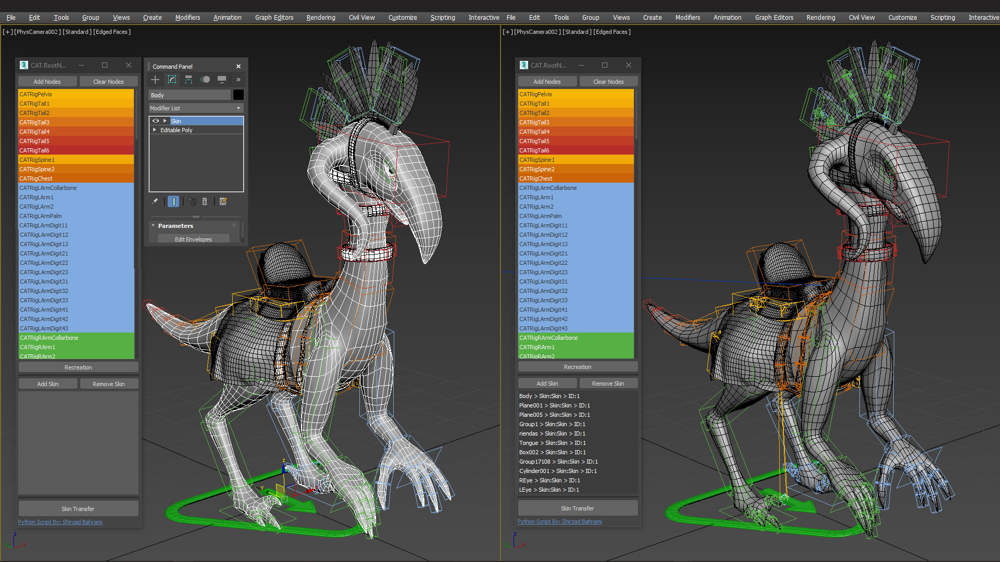

# CAT.RootNode
## Transfer the CAT rig to a new rig structure with a root bone and transfered skins.

---
## How To Use:

### 1. Run CAT.RootNode:
  * Run **CAT.RootNode** by pressing the **X** button and search **CAT.RootNode**
  * Also you can assign a shortcut to it using **Hotkey Editor**
  
### 2. Selecting the CAT nodes:
  * Select All the CAT bones, try not to add wrong type of nodes like **IK, Handles, ...etc**
  
---

### 3. Adding the CAT nodes:
  * Press the **Add Nodes** button to add CAT bones to the node list
  * You can remove the bones by presing the **Clear Nodes**
  * Also script filters the nodes and just let the **"CAT one / Hub Object"** class go through
### 4. Recreating the rig structure:
  * By pressing the **Recreation** button, create new bones with a root bone
  * New nodes have the same name/color/position
  * Also the position and rotation of the new nodes are constrained to the CAT bones
---

### 5. Select the Model with Skin Modifier:
  * Now Select the mesh and in the **modify** panel select the skin modifer and press the **Add Skin**
### 6. Adding more Models:
  * If your character has more than one object with skins repeat the process and add all of them to the list
  * If you have selected wrong model you are able to select it in the list and remove selected from the **Skin List**
  * By selecting the object in the **Skin List** 3Ds Max will select them
---

### 7. Transfer the skin data:
  * Press the **Skin Transfer** button to transfer the skin data from old modifier to new one named **"Transfered Skin"**
  * Note that your old Skin modifier is still there but it's disabled
### 8. Enjoy!
  * Now each of your model has a new **"Transfered Skin"** and the are attached to the new nodes instead of CAT bones.
